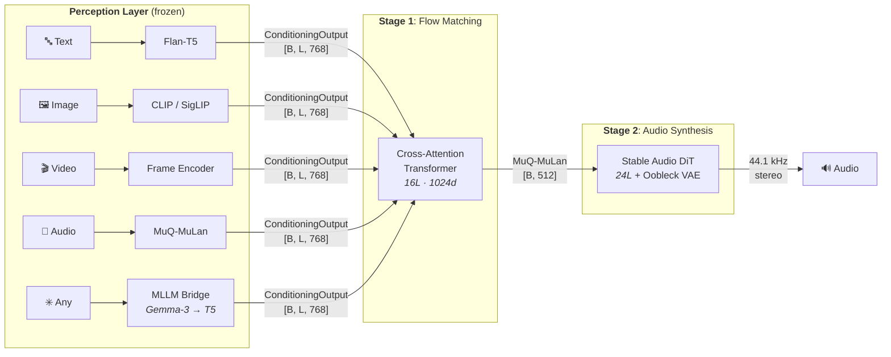

# MUSE: Music Unified Synthesis Engine

**Generate music from any input — text, image, video, or audio — through one unified architecture.**

MUSE decouples *what you perceive* from *how you synthesize*. A shared two-stage flow matching backbone maps any modality to audio; adding a new input requires only a lightweight perception encoder — Stage 2 never changes.

## Key Results

Text-to-music baseline evaluated on MusicBench (2,811 samples):

| Model | FAD ↓ | KL Sigmoid ↑ |
|-------|-------|--------------|
| AudioLDM | 3.82 | 0.744 |
| MusicGen | 5.36 | 0.844 |
| **MUSE** | **2.25** | **0.925** |

**FAD 2.25** — 41% lower than AudioLDM. **KL 0.925** — best semantic alignment. Stereo 44.1 kHz, ~12 s.

Beyond point estimates, the flow matching formulation models $p(z \mid c)$ as a full distribution:
- Vague prompts → higher output diversity (APD 1.037 vs. 0.963 for specific prompts)
- Ambiguous prompts → distinct genre clusters (e.g., *"Cyberpunk city"* splits into synthwave / ambient / industrial)
- Smooth latent interpolation via noise-space SLERP

## Architecture



**Core insight**: Stage 2 is modality-agnostic — it only sees a 512-dim MuQ-MuLan vector. Adding a new modality = one encoder + one Stage 1 training run. The MLLM bridge (Gemma-3 → T5) enables zero-shot input from *any* modality with no training at all.

### Three-Layer Decoupling

| Layer | Responsibility | Interface |
|-------|---------------|-----------|
| **Perception** | Modality → conditioning embeddings | `PerceptionEncoder.encode() → ConditioningOutput` |
| **Generation** | Conditioning → music latent | `Cond2LatentFlow.generate() → [B, 512]` |
| **Synthesis** | Latent → waveform | `LatentToAudioDiT.sample() → [B, 2, T]` |

`ConditioningOutput` — a `[B, L, D]` tensor + padding mask — is the universal contract. Every encoder produces it; every generator consumes it. Switching modality is a one-line config change.

## Supported Pipelines

| Pipeline | Input | Encoder | Training |
|----------|-------|---------|----------|
| `t2m_flow` | Text | Flan-T5 | Stage 1 + 2 ✓ |
| `i2m_flow` | Image | CLIP ViT | Stage 1 only |
| `i2m_bridge` | Image | Gemma-3 → T5 | **None** (zero-shot) |
| `v2m_flow` | Video | CLIP frames | Stage 1 only |
| `a2m_flow` | Audio | MuQ-MuLan | Stage 1 only |

## Usage

```python
from muse.pipelines import TwoStageFlowPipeline

pipe = TwoStageFlowPipeline.from_config("configs/t2m_flow.yaml")
audio = pipe.generate("A melancholic cello solo over soft rain")

# Zero-shot image → music (no additional training)
pipe = TwoStageFlowPipeline.from_config("configs/i2m_bridge.yaml")
audio = pipe.generate("sunset.jpg")
```

## Method

Both stages use **Conditional Flow Matching** (Lipman et al., ICLR 2023) with the OT-affine path:

$$x_t = (1-t)\,x_0 + t\,x_1, \quad v_\theta(x_t, t, c) \approx x_1 - x_0$$

At inference, an ODE solver integrates from Gaussian noise to data. Classifier-free guidance steers generation:

$$v_\text{guided} = v_\text{uncond} + w\,(v_\text{cond} - v_\text{uncond})$$

All modalities pass through a **MuQ-MuLan bottleneck** (512-dim, L2-normalized) — a contrastive audio-text space that provides semantic alignment and a shared interface for Stage 2.

## Project Structure

```
muse/
├── perception/              # Modality encoders (T5, CLIP, MuQ-MuLan, MLLM bridge)
├── generation/flow_matching/ # Stage 1 (Cond2LatentFlow) + Stage 2 (LatentToAudioDiT)
├── pipelines/               # Config-driven two-stage assembly
├── sampling/                # Latent selection (peak, diverse, DBSCAN, k-means)
├── data/                    # Multi-modal dataset with JSONL manifest
└── training/                # Distributed trainer interface
```

## References

- Lipman et al., *Flow Matching for Generative Modeling*, ICLR 2023
- Evans et al., *Stable Audio Open*, 2024
- MuQ-MuLan: contrastive audio-text embeddings
